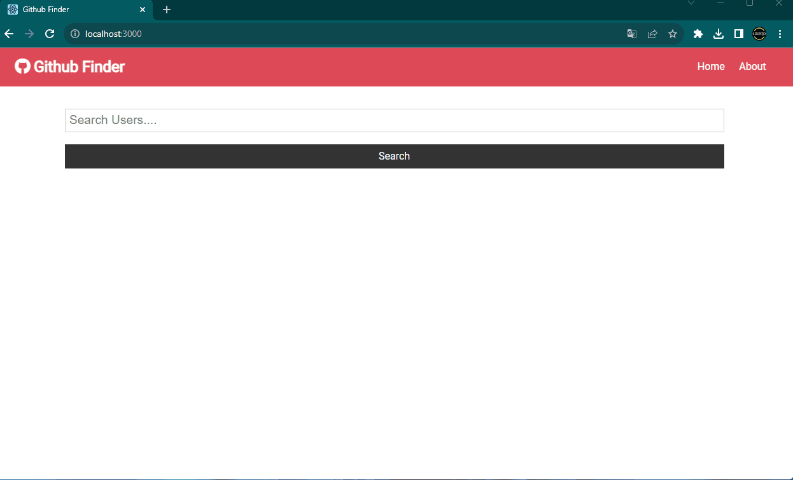

<h1>
 GitHub Finder with React JS
</h1>

I have developed a project using React that allows users to explore GitHub profiles of their choice. This application enables users to view various details about the searched user, including their location, current workplace, its location, and the number of repositories they have. By utilizing React, the project offers an intuitive and interactive interface for users to easily access and analyze GitHub profiles, enhancing the overall user experience.

<h1>Used Technologies </h1>
<ul>

<h1>
 Preview 🎥
</h1>

